# ToBeOrToHave JavaFX

Ce projet a été réalisé dans le cadre de la matière "IHM" et codé en JavaFX.

Le but était de créer différentes interfaces autour d'une même enseigne nommée "ToBeOrToHave".

Ce projet était constituée de trois parties :

- Une interface pour l'**enseigne** ToBeOrToHave créée par Nassim Bounouas et moi-même.
- Une pour un **centre commercial** accueillant un magasin ToBeOrToHave créée par Jehan Milleret et Marc Jourdes.
- Enfin une interface pour un **magasin** ToBeOrToHave créée par Florian Bourniquel et Nikita Rousseau

Chaque binôme avait un cahier des charges à respecter :

- [Cahier des charges de l'enseigne](enseigne/README.md)
- [Cahier des charges du magasin](magasin/README.md)
- [Cahier des charges du centre commercial](centreCommercial/README.md)

## Captures d'écran

### Enseigne

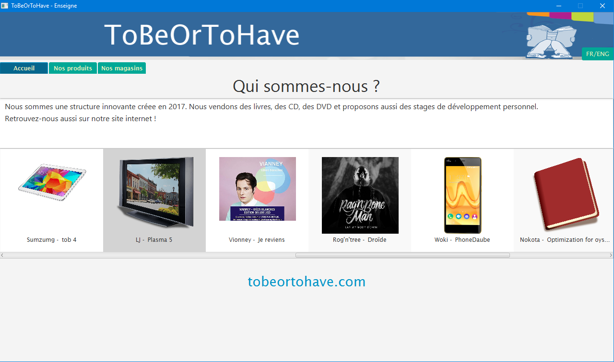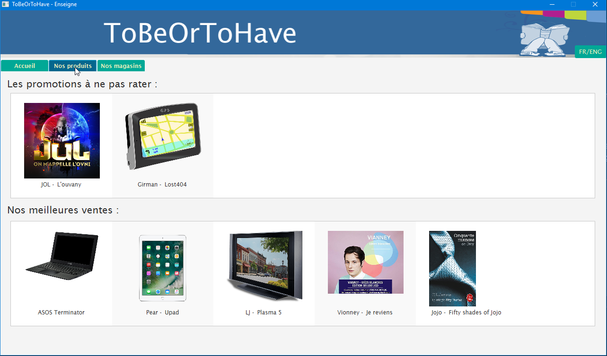
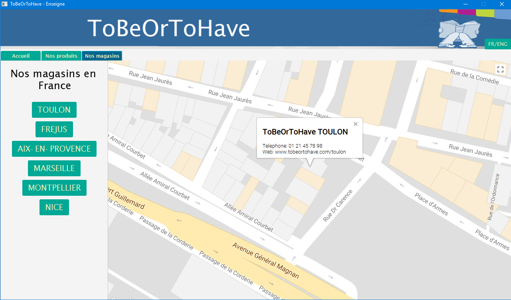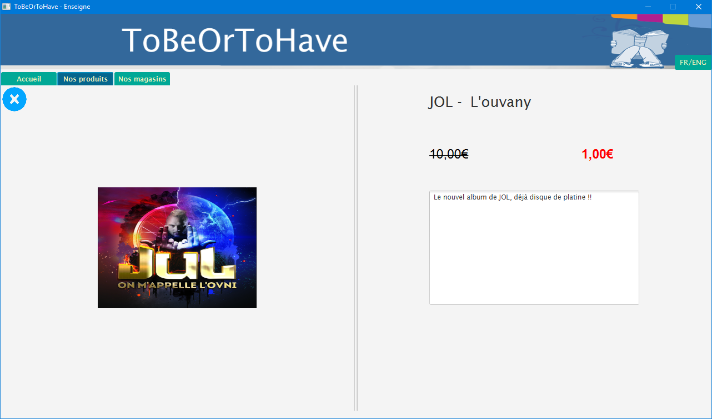

### Centre commercial

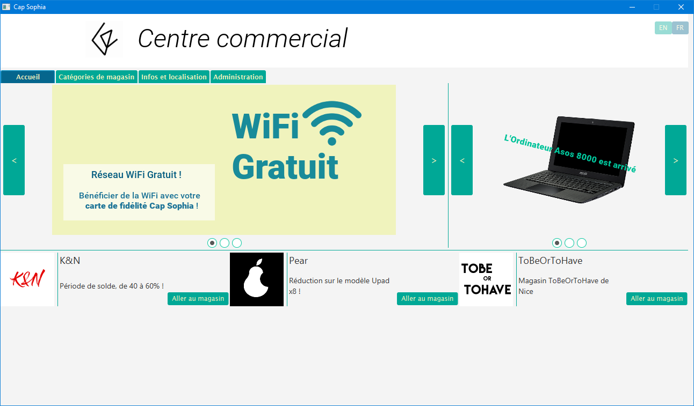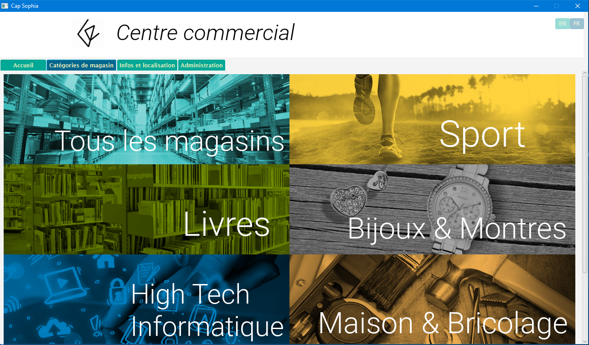
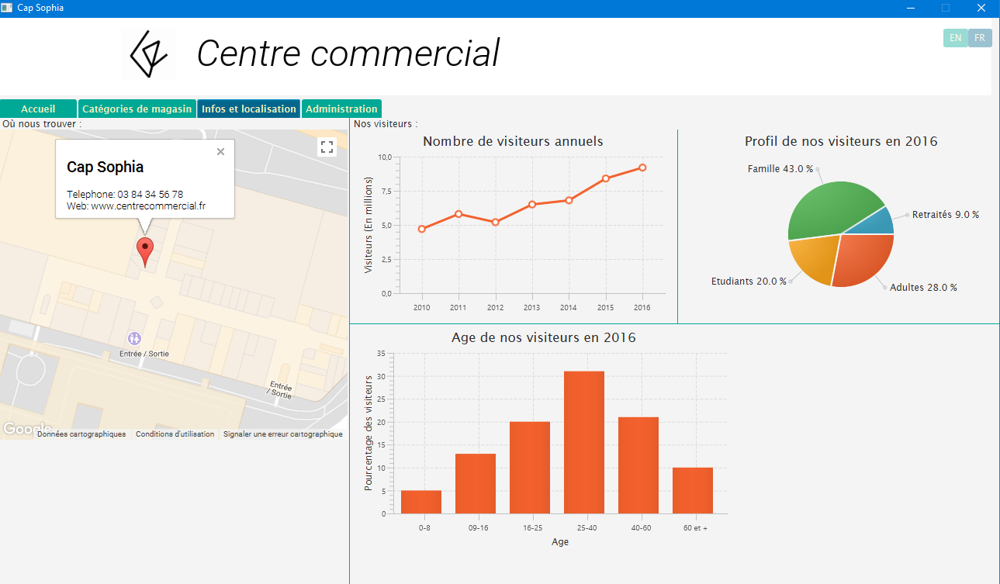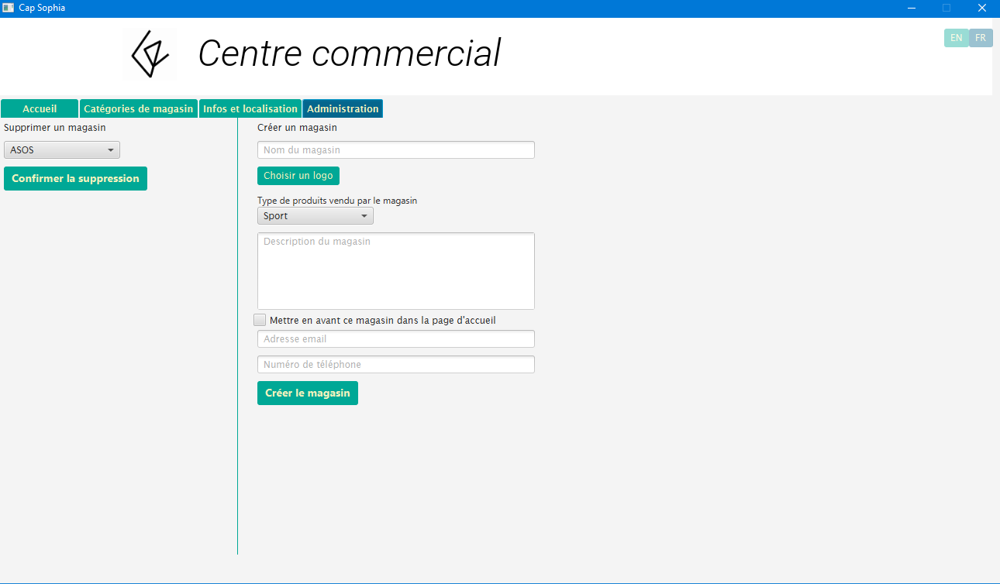

### Magasin

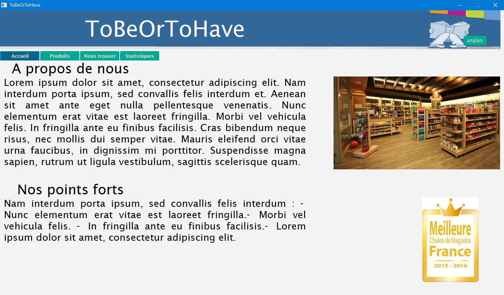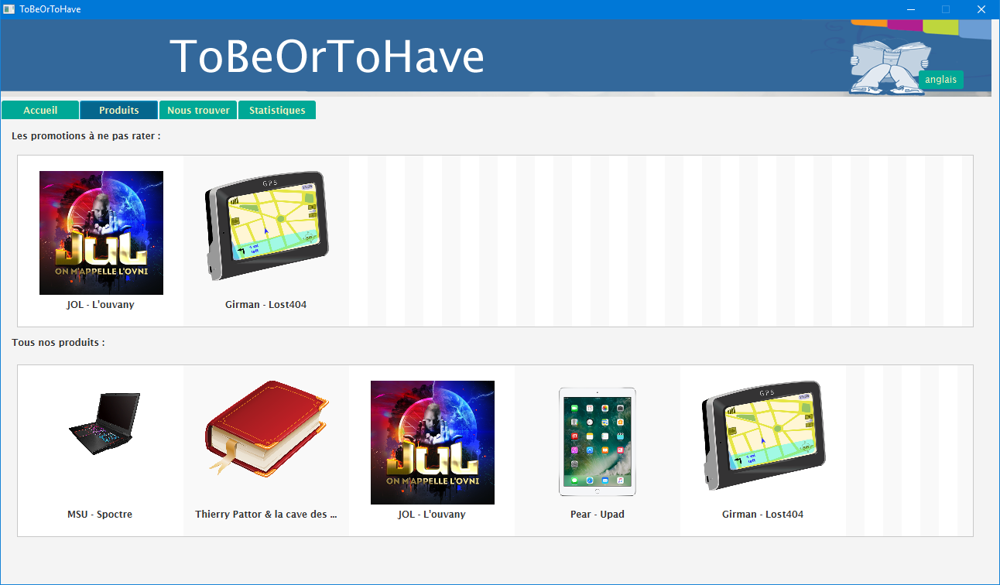
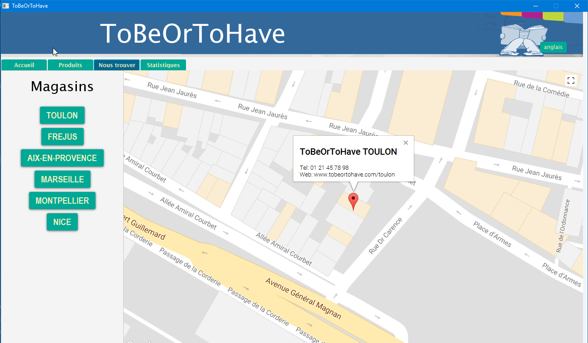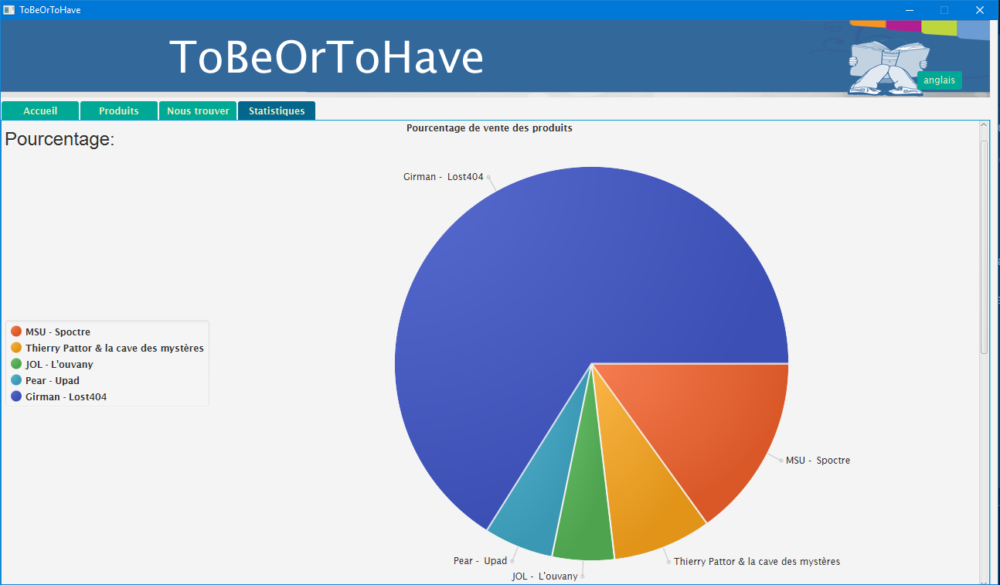